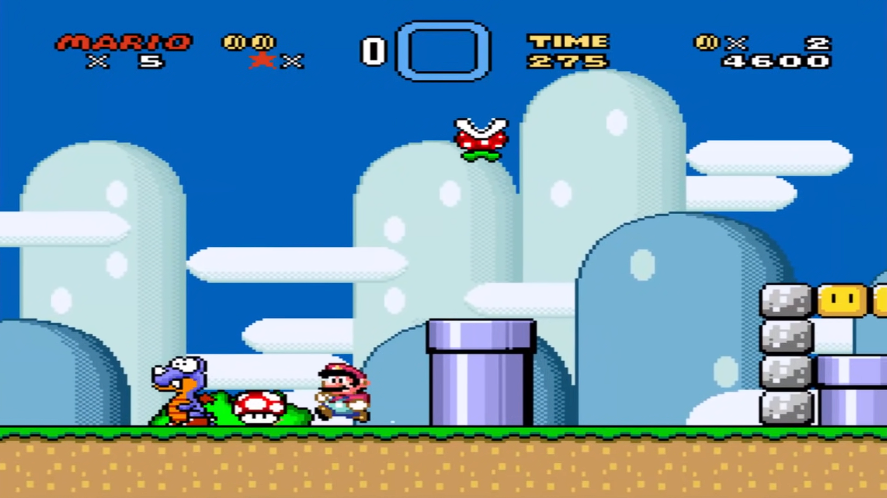

<!-- GENERAL GAME INFO -->
 

  <h1 align="center">Super Mario World</h1>

  

    Super Mario World is the fourth installment in the Super Mario series and was originally released on SNES, it is a 2D sidescrolling platformer with 9 worlds and 74 levels. 
     
    <strong>Original game : </strong>
    <a href="https://en.wikipedia.org/wiki/Super_Mario_World"><strong>General info »</strong></a>
    ·
    <a href="https://www.youtube.com/watch?v=3Tc_Ek0ASSA"><strong>Youtube video »<strong></a>
     
     
  

<!-- TABLE OF CONTENTS -->

  
Table of Contents

  <ol>
    <li>
      <a href="#about-the-project">About The Project</a>
    </li>
    <li>
      <a href="#my-version">My version</a>
    </li>
    <li>
      <a href="#getting-started">Getting Started</a>
    </li>
    <li><a href="#how-to-play">How To Play</a></li>
    <li><a href="#class-structure">Class structure</a></li>
    <li><a href="#checklist">Checklist</a></li>
    <li><a href="#contact">Contact</a></li>
    <li><a href="#acknowledgments">Acknowledgments</a></li>
  </ol>

<!-- ABOUT THE PROJECT -->
## About The Project

Here's why:
* I'm a pretty big mario fan and i like 2D platformers in general.
* I chose this over the first mario game because it introduces more new features so it won't be too easy for me to make.
* A lot of the things this game has will make me more used to programming in general i think.

(<a href="#readme-top">back to top</a>)

## My version

This section gives a clear and detailed overview of which parts of the original game I planned to make.

### The minimum I will most certainly develop:
* All the movement of mario. 
* All of the enemys in the levels i will make.
* The ability to pick up power-ups.
* The ability to defeat enemys.
* The first level of the game.

### What I will probably make as well:
* A few more levels that i think are interesting.
* More enemy types.

### What I plan to create if I have enough time left:
* The whole of world 1 
* A world map

(<a href="#readme-top">back to top</a>)

<!-- GETTING STARTED -->
## Getting Started
Download the visual studio file and run it in a debug window(for now probably).

### Prerequisites

* Visual Studio 2022

### How to run the project

The Newest version you can find on this page is recommended to play. Older versions are just versions with less content i programmed in it.
* No extra steps required

(<a href="#readme-top">back to top</a>)

<!-- HOW TO PLAY -->
## How to play

The controls are pretty simple

### Controls
* Arrow keys left and right to move accordingly
* Arrow key up to look up
* Arrow key down to crouch
* Space to jump
* Shift to sprint
* Spinjumping with left alt
* Going down a pipe by pressing the down key or in a pipe by holding the position of the pipe

(<a href="#readme-top">back to top</a>)

<!-- CLASS STRUCTURE -->
## Class structure 

### Object composition 
I have used object composition for the fireballs that are shot by mario;

### Inheritance 
Inheritance is used for all enemy types, they all inherit from one enemy class.
Inhertitance is also udes for the blocks, the question mark block is inherited from the normal block.
The dragon coin inherits from the basic coin.

### Agregation
Agregation is used for the managers: Enemy manager, texture manager and sound manager. They are used in multiple instances of the level class.

### Association
Association is not used

(<a href="#readme-top">back to top</a>)

<!-- CHECKLIST -->
## Checklist

- [x] Accept / set up github project
- [x] week 01 topics applied
    - [x] const keyword applied proactively (variables, functions,..)
    - [x] static keyword applied proactively (class variables, static functions,..)
    - [x] object composition (optional)
- [x] week 02 topics applied
- [x] week 03 topics applied
- [x] week 04 topics applied
- [x] week 05 topics applied
- [x] week 06 topics applied
- [x] week 07 topics applied
- [x] week 08 topics applied
- [ ] week 09 topics applied (optional)
- [x] week 10 topics applied (optional)

(<a href="#readme-top">back to top</a>)

<!-- CONTACT -->
## Contact

Lennert Saerens - lennert.saerens@student.howest.be

Project Link: [https://github.com/HowestDAE/dae28-LennertSaerens1](https://github.com/HowestDAE/dae28-LennertSaerens1)

(<a href="#readme-top">back to top</a>)

<!-- ACKNOWLEDGMENTS -->
## Acknowledgments

Use this space to list resources you find helpful and would like to give credit to. 

* [The site where i found all my sprites](https://www.mariouniverse.com/sprites-snes-smw/)
* [The site where i found all the sound effects](https://themushroomkingdom.net/media/smw/wav)
* [The site where i found all the sound streams](https://downloads.khinsider.com/game-soundtracks/album/super-mario-world-snes-gamerip)

(<a href="#readme-top">back to top</a>)

